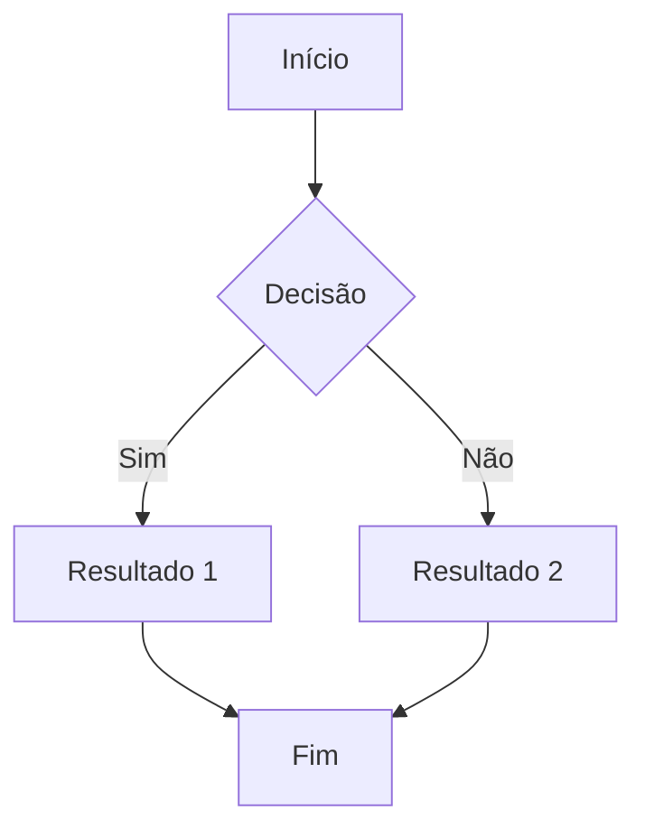
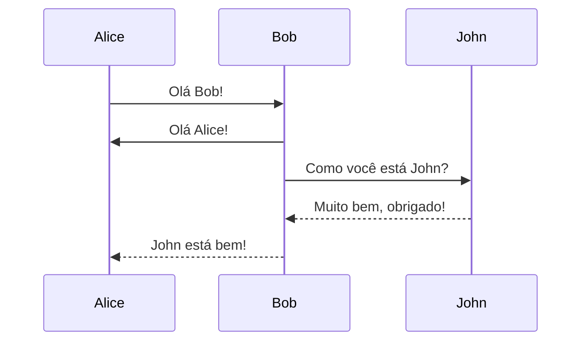
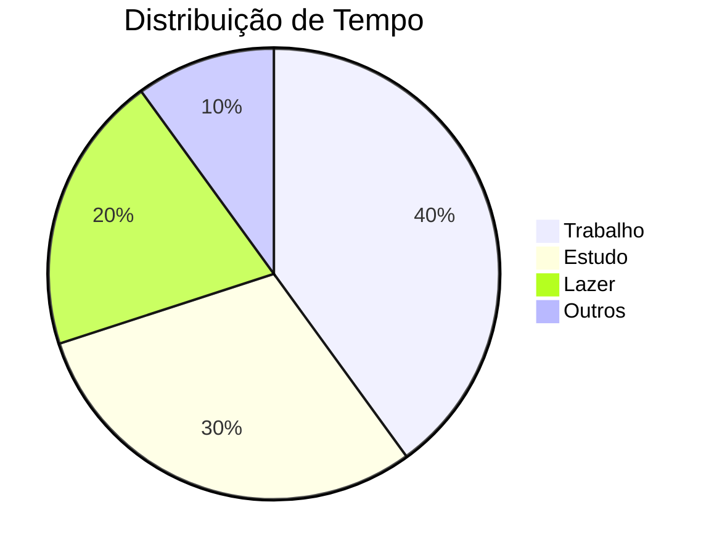
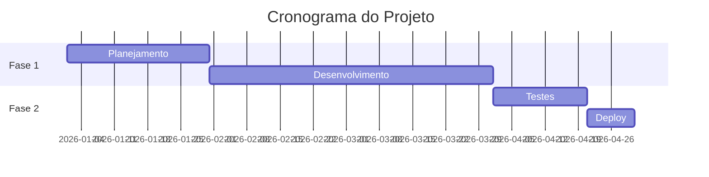
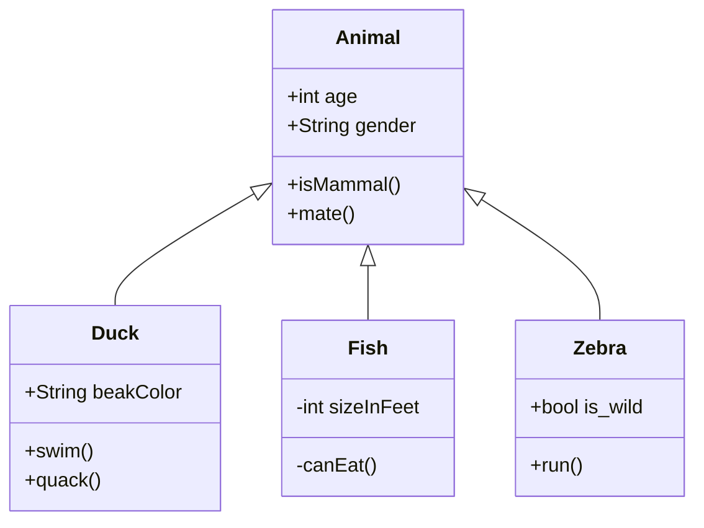
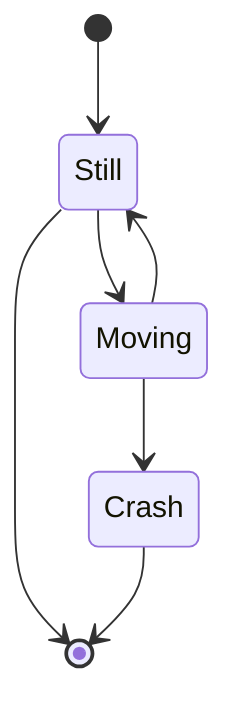

${toc}

## 1. Formatação Básica

Texto normal com **negrito**, *itálico*, ***negrito e itálico***, ~~riscado~~, ==destacado==, H~2~O (subscrito), X^2^ (sobrescrito), e ++texto inserido++.

Você pode usar ==destacar texto importante== e adicionar H~2~O para fórmulas químicas ou X^2^ + Y^2^ = Z^2^ para matemática simples.

## 2. Links e Imagens

[Link interno](#formatacao-basica) | [Link externo](https://www.google.com)


## 3. Listas

### Lista não ordenada
- Item 1
- Item 2
  - Subitem 2.1
  - Subitem 2.2
- Item 3

### Lista ordenada
1. Primeiro item
2. Segundo item
   1. Subitem 2.1
   2. Subitem 2.2
3. Terceiro item

### Lista de tarefas
- [x] Tarefa concluída
- [x] Outra tarefa concluída
- [ ] Tarefa pendente
- [ ] Outra tarefa pendente

## 4. Tabelas

| Nome      | Idade | Cidade        |
|-----------|-------|---------------|
| João      | 25    | São Paulo     |
| Maria     | 30    | Rio de Janeiro|
| Pedro     | 28    | Belo Horizonte|

### Tabela com alinhamento

| Esquerda | Centro | Direita |
|:---------|:------:|--------:|
| A        | B      | C       |
| 1        | 2      | 3       |

### Tabela Complexa (Multiline)

|              | Grouping                    ||
|First Header  | Second Header | Third Header |
|--------------|:-------------:|-------------:|
|Content       | *Long Cell*                 ||
|Content       | **Cell**      | Cell         |
|New section   | More          | Data         |

## 5. Blocos de Código

Código inline: `const x = 42;`

```javascript
// Código JavaScript com syntax highlighting
function fibonacci(n) {
  if (n <= 1) return n;
  return fibonacci(n - 1) + fibonacci(n - 2);
}

console.log(fibonacci(10));
```

```python
# Código Python com syntax highlighting
def quick_sort(arr):
    if len(arr) <= 1:
        return arr
    pivot = arr[len(arr) // 2]
    left = [x for x in arr if x < pivot]
    middle = [x for x in arr if x == pivot]
    right = [x for x in arr if x > pivot]
    return quick_sort(left) + middle + quick_sort(right)

print(quick_sort([3, 6, 8, 10, 1, 2, 1]))
```

```html
<!-- Código HTML -->
<!DOCTYPE html>
<html lang="pt-BR">
<head>
    <meta charset="UTF-8">
    <title>Exemplo</title>
</head>
<body>
    <h1>Olá Mundo!</h1>
</body>
</html>
```

```css
/* Código CSS */
.container {
  max-width: 1200px;
  margin: 0 auto;
  padding: 2rem;
  background: var(--bg-elevated);
}
```

## 6. Citações

> Esta é uma citação simples.

> Esta é uma citação de múltiplas linhas.
> Ela continua aqui.
> 
> E pode ter parágrafos separados.

> Citações podem ser aninhadas
>> Como esta citação dentro de outra
>>> E podem ter vários níveis

## 7. Linha Horizontal

Abaixo há uma linha horizontal:

---

## 8. Emojis

:smile: :heart: :thumbsup: :rocket: :fire: :star: :tada: :100: :coffee: :computer: :bulb: :zap:

## 9. Abreviações

HTML e CSS são linguagens essenciais para web. Use HTTP para comunicação e API para integração.

*[HTML]: HyperText Markup Language
*[CSS]: Cascading Style Sheets
*[HTTP]: HyperText Transfer Protocol
*[API]: Application Programming Interface

## 10. Notas de Rodapé

Este texto tem uma nota de rodapé[^1] e outra nota[^2]. Você pode ter quantas notas[^3] precisar.

[^1]: Esta é a primeira nota de rodapé.
[^2]: Esta é a segunda nota de rodapé com mais detalhes e explicações adicionais.
[^3]: Notas de rodapé podem conter **formatação** e [links](https://example.com).

## 11. Listas de Definição

Termo 1
: Definição do termo 1

Termo 2
: Primeira definição do termo 2
: Segunda definição do termo 2

Markdown
: Linguagem de marcação leve
: Criada por John Gruber
: Amplamente utilizada para documentação

Python
: Linguagem de programação de alto nível
: Conhecida por sua sintaxe limpa e legível

## 12. Keyboard Keys

Pressione <kbd>Ctrl</kbd> + <kbd>C</kbd> para copiar.

Use <kbd>Ctrl</kbd> + <kbd>V</kbd> para colar.

Para salvar, use <kbd>Ctrl</kbd> + <kbd>S</kbd>.

Atalhos do desenvolvedor: <kbd>Ctrl</kbd> + <kbd>Shift</kbd> + <kbd>I</kbd>

No Mac: <kbd>Cmd</kbd> + <kbd>Space</kbd>

## 13. Spoilers

!!Este texto está oculto e será revelado ao clicar!!

!!Spoiler com conteúdo importante que não deve ser visto imediatamente!!

## 14. Containers Customizados

::: note Nota Importante
Este é um container de nota. Use para informações adicionais que complementam o conteúdo principal.
:::

::: tip Dica Útil
Este é um container de dica. Perfeito para sugestões úteis e boas práticas que podem ajudar o leitor.
:::

::: warning Aviso
Este é um container de aviso. Use para alertar sobre possíveis problemas ou situações que requerem atenção.
:::

::: danger Perigo
Este é um container de perigo. Use para avisos críticos que podem causar problemas sérios se ignorados.
:::

::: success Sucesso
Este é um container de sucesso. Use para mensagens positivas, confirmações e resultados bem-sucedidos.
:::

::: info Informação
Este é um container de informação. Use para dados relevantes, contexto adicional e detalhes importantes.
:::

::: example Exemplo Prático
Este é um container de exemplo. Perfeito para demonstrações práticas e casos de uso reais.

```javascript
const exemplo = "código dentro do container";
console.log(exemplo);
```
:::

::: important Muito Importante
Este é um container de conteúdo importante. Use para destacar informações cruciais que não podem ser perdidas.
:::

::: caution Cuidado
Este é um container de cuidado. Similar ao warning, mas com um tom menos urgente.
:::

## 15. Matemática (LaTeX)

### Equações Inline

A equação mais famosa: $E = mc^2$

Fórmula de Pitágoras: $a^2 + b^2 = c^2$

Área do círculo: $A = \pi r^2$

### Equações em Bloco

Integral de Gauss:

$$
\int_{-\infty}^{\infty} e^{-x^2} dx = \sqrt{\pi}
$$

Fórmula quadrática:

$$
x = \frac{-b \pm \sqrt{b^2 - 4ac}}{2a}
$$

Série de Taylor:

$$
f(x) = f(a) + f'(a)(x-a) + \frac{f''(a)}{2!}(x-a)^2 + \frac{f'''(a)}{3!}(x-a)^3 + \cdots
$$

Matriz:

$$
\begin{bmatrix}
a & b & c \\
d & e & f \\
g & h & i
\end{bmatrix}
$$

Somatório:

$$
\sum_{i=1}^{n} i = \frac{n(n+1)}{2}
$$

## 16. Vídeos

### YouTube
@[youtube](dQw4w9WgXcQ)

### Vimeo
@[vimeo](123456789)

## 17. Diagramas Mermaid

### Fluxograma



### Diagrama de Sequência



### Gráfico de Pizza



### Gráfico de Gantt



### Diagrama de Classes



### Diagrama de Estados



## 18. Atributos Personalizados

Este parágrafo tem uma classe CSS customizada.{.text-center #custom-id}

**Texto em negrito e grande**{.text-large style="color: var(--accent-cyan);"}

Texto centralizado e em destaque{.text-center .text-bright}

## 19. Details / Summary (Expandível)

<details>
<summary>Clique para expandir</summary>

Este conteúdo está oculto até você clicar no título acima.

Você pode incluir:
- Listas
- **Formatação**
- `Código`

```javascript
console.log("Até código!");
```
</details>

<details>
<summary>Outro exemplo com mais conteúdo</summary>

### Conteúdo expandível

Este é um exemplo mais complexo com múltiplos elementos:

1. Item um
2. Item dois
3. Item três

> E até citações!

</details>

## 20. Checklist Avançada

- [ ] Tarefa 1
- [x] Tarefa 2 (concluída)
- [ ] Tarefa 3
  - [x] Subtarefa 3.1
  - [ ] Subtarefa 3.2
  - [ ] Subtarefa 3.3
- [x] Tarefa 4
  - [x] Todas as subtarefas concluídas
  - [x] Tudo funcionando

## 21. Combinações Complexas

Você pode combinar **_negrito e itálico_** com ==destaque== e ~~riscado~~.

Lista com vários elementos:
- Item com `código inline`
- Item com **negrito** e *itálico*
- Item com [link](https://example.com) externo
- Item com H~2~O e X^2^
- Item com ==destaque== e ++inserção++

### Tabela com formatação

| Recurso           | Status | Notas                    |
|-------------------|:------:|--------------------------|
| **Negrito**       | ✅     | `**texto**`              |
| *Itálico*         | ✅     | `*texto*`                |
| ~~Riscado~~       | ✅     | `~~texto~~`              |
| ==Destacado==     | ✅     | `==texto==`              |
| ++Inserido++      | ✅     | `++texto++`              |
| Sub~script~       | ✅     | `H~2~O`                  |
| Super^script^     | ✅     | `X^2^`                   |

### Citação com código

> "A única maneira de fazer um ótimo trabalho é amar o que você faz."
> — Steve Jobs
> 
> ```python
> def amor_trabalho():
>     return "Sucesso!"
> ```

## 22. Miscelânea

### Emojis em contexto

Adorei este tutorial! :heart: :star: :tada:

Programar em Python :snake: é muito divertente! :rocket:

Café :coffee: + Código :computer: = Produtividade :zap:

### Texto com múltiplos formatos

Este texto tem **negrito**, *itálico*, `código`, [link](https://example.com), ==destaque==, ~~riscado~~, ++inserido++, H~2~O, X^2^, e até <kbd>Ctrl</kbd>+<kbd>C</kbd> tudo junto!

### Lista dentro de citação

> Motivos para usar Markdown:
> 1. Simples e legível
> 2. Portátil
> 3. Versátil
> 4. Bem suportado

---

## Conclusão

Este documento demonstra **TODOS** os recursos de Markdown suportados pelo seu blog:

✅ Formatação básica (negrito, itálico, riscado, destacado, inserido)  
✅ Subscrito e sobrescrito  
✅ Links e imagens (com tamanho)  
✅ Listas (ordenadas, não ordenadas, tarefas, definição)  
✅ Tabelas (simples, com alinhamento, complexas)  
✅ Blocos de código com syntax highlighting  
✅ Citações (simples e aninhadas)  
✅ Emojis  
✅ Abreviações  
✅ Notas de rodapé  
✅ Keyboard keys  
✅ Spoilers  
✅ Containers customizados (9 tipos)  
✅ Matemática LaTeX (inline e bloco)  
✅ Vídeos (YouTube e Vimeo)  
✅ Diagramas Mermaid (6 tipos)  
✅ Atributos personalizados  
✅ Details/Summary expandível  
✅ TOC (Sumário automático)  
✅ Âncoras de cabeçalho  
✅ Links externos com ícone  

**Use este documento como referência** para criar conteúdo rico e expressivo! :rocket:

{.text-center}

---

**Última atualização:** 25 de Janeiro de 2026  
**Versão:** 2.0 Completa